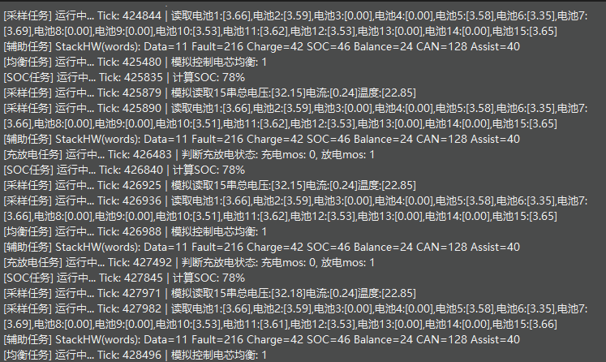
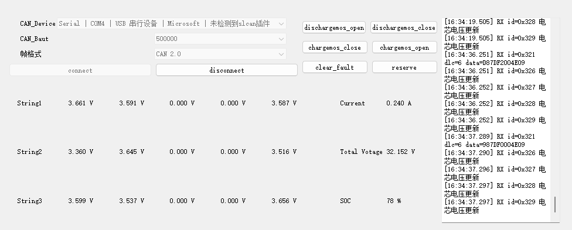
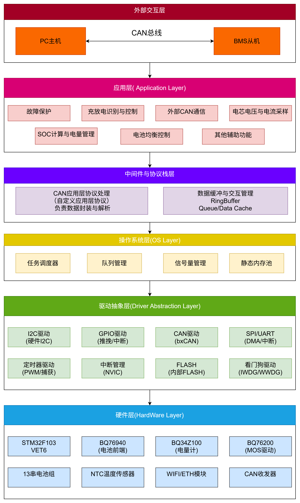
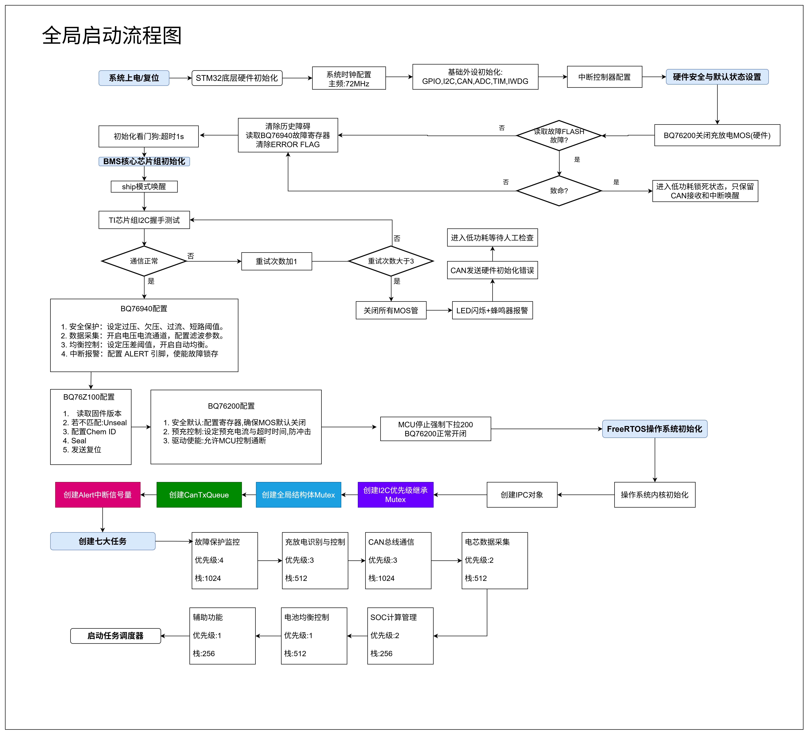

# BMS-48Pro — 48V/15S 智能电池管理系统 (Intelligent Battery Management System)

[English Version](#english-version) | [中文版](#中文版)

---

<a id="中文版"></a>
面向 48V 电动两轮/滑板车/便携储能/小型AGV 等场景的 BMS 软件工程示例。项目包含基于 FreeRTOS 的 MCU 固件、自定义 CAN 通信协议，以及基于 Qt 开发的上位机，提供从底层数据采集到上层联调的完整端到端实现。

---

## 项目背景与应用场景 (Background & Use Cases)

在轻型动力与储能领域（如电动两轮车、AGV 机器人、便携式户外电源），锂电池组的安全管理长期面临几个行业痛点：
1. **电芯一致性差导致寿命缩短**：多串电池在长期充放电中极易出现压差，市面上低端 BMS 往往缺乏有效的均衡机制或均衡逻辑死板，导致木桶效应，严重缩短电池组整体寿命。
2. **保护机制实时性不足**：传统单片机裸机架构在处理复杂通信与业务逻辑时，极易阻塞毫秒级的过压/过流/短路等硬件级安全保护响应。
3. **软硬件强耦合与高昂调试成本**：底层代码与前端芯片强绑定，一旦缺芯或更换方案则需重写大量代码；同时，全链路联调极度依赖昂贵的 CAN 分析仪。

**本项目的核心优势与解决之道：**
- **动态均衡策略**：设计了独立的均衡控制任务，基于最小电压与动态压差阈值（如0.2V）实时生成掩码并下发，有效缓解电芯不一致问题，延长电池组寿命。
- **高并发与强实时保障**：引入 FreeRTOS 抢占式调度，将底层高频采集/告警与低频通信解耦，确保极端工况下告警指令绝不被阻塞。
- **解耦架构与极低联调门槛**：采用严格的 `BSP → APP → Core` 三层架构以适应未来的硬件替换；并配套开发支持串口 SLCAN 协议的 Qt 上位机，使用十几元的 USB 转串口模块即可实现全闭环的控制与状态监控。

**应用领域**：低速四轮车 / 换电柜电池包 / 商用服务机器人 / 中小型户外电源。

---

## 演示 (Demo)

**MCU 端日志监控**（多任务并发、数据采集、故障保护联动）：



**Qt 上位机**（CAN/SLCAN 接入、报文解析、MOS 实时控制）：



---

## 系统特性

### MCU 固件 (Firmware)
- **核心器件适配**：采用 **TI BQ76940** 模拟前端，基于 **STM32F103VET6** 控制器。
- **并发任务模型**：基于 FreeRTOS 构建 7 大核心任务（数据采集、故障保护、充放电控制、SOC 计算、均衡、CAN 通信、辅助监测），任务间通过 `Mutex/Semaphore/MessageQueue` 实现安全的资源访问与数据同步。
- **采集与保护**：实现 15 串电芯电压、总电流、NTC 温度的高频采集；内置独立异常判定任务，触发过流/过压时通过 CAN 告警队列异步上报。
- **均衡控制逻辑**：动态计算电芯压差，基于阈值自动生成均衡掩码并下发至前端芯片。
- **高可靠性设计**：集成独立看门狗 (IWDG) 与任务栈监控水位，便于长稳测试评估。

### 上位机 (Host)
- **多接口适配**：支持标准 Qt CAN 插件及自研串行 CAN (SLCAN) 适配层，兼容常见 USB-CAN 模块。
- **控制链路打通**：通过自定协议（StdID=0x324）发送充放电 MOS 控制指令，并实现超时检测机制。
- **可视化日志**：报文收发、状态解析与错误告警按时间戳记录，降低联调成本。

---

## 软件架构

系统采用分层设计（`BSP` → `APP` → `Core`），实现底层硬件驱动与上层业务逻辑的解耦。

- **架构全景**：
- **核心流程**：
- *注：架构设计图与总流程图中包含了对 BQ34Z100（专业电量计）与 BQ76200（高端高边驱动）的完整设计规划。当前 v1.0 代码版本采用软解 OCV 计算 SOC 与基础驱动跑通核心链路，旨在验证多任务调度与协议栈，完整硬件级方案预留于后续演进。*

---

## 通信协议

基于标准 CAN 2.0，定义了轻量级的内部通信协议，便于后续向 CAN FD 扩展。协议定义详见 `firmware/APP/app_can.h`。

| 报文方向 | 标准 ID | 报文名称 | DLC | 数据内容描述 |
|---|---:|---|---:|---|
| BMS → 上位机 | `0x321` | Basic Status | 6 | 总电压、总电流、SOC、有效串数 |
| BMS → 上位机 | `0x326`~`0x329` | Cell Voltages | 6/8 | 1~15 串电芯单体电压分包 |
| BMS → 上位机 | `0x320` | Alarm Info | 4 | 告警码、告警值、系统时间戳 |
| 上位机 → BMS | `0x324` | MOS Control | 2 | 充、放电 MOS 强制控制指令 |

---

## 快速上手

### 1. 仓库结构
```text
.
├── firmware/   # MCU 固件源码 (C/STM32 HAL/FreeRTOS)
├── host/       # Qt 上位机工程 (C++/Qt5)
├── docs/       # 架构图、流程图及 Draw.io 源文件
└── assets/     # README 演示资源
```

### 2. 固件编译 (Keil MDK)
- 目标平台：`STM32F103VET6`（基于 F103 模板工程构建，硬件寄存器映射兼容）。
- 打开 `firmware/MDK-ARM/Template_STM32F103C8T6_Hal_20260425.uvprojx`，直接编译生成 hex 文件进行烧录。

### 3. 上位机运行 (Qt 5)
- 环境依赖：Qt 5.12+ (需安装 `Qt Widgets`, `Qt SerialBus`, `Qt SerialPort` 模块)。
- 打开 `host/BMS_48Pro_UpperComputer/BMS_48Pro_UpperComputer.pro` 进行编译。
- 启动后选择本地的 CAN 接口或对应的串口设备即可建立连接。

---

## 演进规划 (Roadmap)

本系统在架构设计时已为后续的进阶演进预留了接口，未来可沿以下方向进行深化：

- **核心算法进阶**：在现有 OCV 基础上，引入基于库仑计的安时积分与动态温度补偿机制，进一步提升 SOC 估算精度，并拓展 SOH (健康状态) 监测。
- **安全冗余与防护**：深化 BQ76940 内部硬件级短路/过载寄存器的精细化配置；引入 Flash/EEPROM 参数持久化机制，确保掉电状态下的数据连续性。
- **诊断与 OTA 升级**：向基于 UDS 的标准汽车/工控诊断协议演进，并以此为基础打通 IAP (In-Application Programming) 固件在线升级链路。
- **上位机分析增强**：上位机将集成实时波形绘制、数据离线落盘与回放功能，构建更直观的数据看板与故障追溯平台。

---

<a id="english-version"></a>
# English Version

A comprehensive Battery Management System (BMS) software engineering showcase designed for 48V scenarios (e-bikes, e-scooters, portable power stations, and compact AGVs). The repository provides an end-to-end implementation including MCU firmware (FreeRTOS), custom CAN protocols, and a Qt-based host application.

## Background & Use Cases
In the light EV and energy storage sectors, battery pack safety management has long faced several industry pain points:
1. **Poor Cell Consistency Reducing Lifespan**: Multi-series battery packs are prone to voltage imbalances over prolonged charge/discharge cycles. Low-end BMS solutions on the market often lack effective balancing mechanisms, leading to the "barrel effect" and severely shortening the pack's overall lifespan.
2. **Insufficient Real-time Protection**: Traditional bare-metal MCU architectures easily block millisecond-level hardware safety responses (over-voltage/over-current/short-circuit) when processing complex communications and business logic.
3. **Tight Hardware Coupling & High Debugging Costs**: Low-level code is tightly bound to the Analog Front-End (AFE) chip, requiring massive rewrites during chip shortages or solution changes. Furthermore, full-loop debugging heavily relies on expensive CAN analyzers.

**Core Advantages & Solutions of this Project:**
- **Dynamic Balancing Strategy**: Designed an independent balancing control task that dynamically generates and applies balancing masks based on minimum voltage and differential thresholds (e.g., 0.2V), effectively mitigating cell inconsistency and extending battery life.
- **High Concurrency & Real-time Guarantee**: Introduced FreeRTOS preemptive scheduling to decouple high-frequency acquisition/alarms from low-frequency communications, ensuring alarm commands are never blocked under extreme conditions.
- **Decoupled Architecture & Low-Barrier Debugging**: Adopted a strict `BSP → APP → Core` 3-tier architecture to accommodate future hardware replacements. Additionally, developed a Qt host application supporting the serial SLCAN protocol, enabling full closed-loop control and status monitoring with a low-cost USB-to-TTL module.

**Target Applications**: Low-speed 4-wheelers / Battery Swapping Cabinets / Commercial Service Robots / Mid-to-small Portable Power Stations.

## System Features

### MCU Firmware
- **Hardware Foundation**: Built on the **STM32F103VET6** MCU and **TI BQ76940** Analog Front-End (AFE).
- **Concurrent Task Model**: Utilizes FreeRTOS to manage 7 core tasks (Data Acquisition, Protection, Charge/Discharge Control, SOC Calculation, Cell Balancing, CAN Communication, and Watchdog). Thread-safety is ensured via `Mutex`, `Semaphore`, and `MessageQueue`.
- **Acquisition & Protection**: High-frequency sampling of 15-series cell voltages, pack current, and NTC temperature. Features asynchronous CAN alarm reporting for over-current and over-voltage events.
- **Cell Balancing**: Dynamic differential voltage calculation to automatically generate balancing masks applied to the AFE.
- **Reliability**: Integrated Independent Watchdog (IWDG) and task stack HighWaterMark monitoring for stability assessment.

### Host Application (Qt)
- **Multi-Interface Support**: Compatible with standard Qt CAN plugins and custom Serial-CAN (SLCAN) adapters.
- **Control Link**: Implements a custom protocol (StdID=0x324) for direct MOSFET switching with a 500ms timeout acknowledgment mechanism.
- **Visual Logging**: Time-stamped logs for RX/TX frames, parsed states, and error alerts to streamline debugging.

## Software Architecture
The system adopts a strictly decoupled 3-tier architecture (`BSP` → `APP` → `Core`).
*(For architecture and flowchart diagrams, please refer to the `docs/` directory. Note: The design diagrams include planning for the BQ34Z100 fuel gauge and BQ76200 high-side driver. The current v1.0 code focuses on validating the core RTOS multi-tasking and CAN protocol stack, using software-based OCV for SOC. Full hardware-level implementation is reserved for future evolution.)*

## CAN Protocol
A lightweight, standard CAN 2.0 protocol designed for easy extension to CAN FD.

| Direction | StdID | Name | DLC | Description |
|---|---:|---|---:|---|
| BMS → Host | `0x321` | Basic Status | 6 | Pack Voltage, Current, SOC, Active Cells |
| BMS → Host | `0x326`~`0x329` | Cell Voltages | 6/8 | Grouped reporting for cells 1~15 (mV) |
| BMS → Host | `0x320` | Alarm Info | 4 | Error Code, Value, System Tick |
| Host → BMS | `0x324` | MOS Control | 2 | CHG / DSG MOSFET Override |

## Quick Start
1. **Firmware**: Open `firmware/MDK-ARM/Template_STM32F103C8T6_Hal_20260425.uvprojx` via Keil MDK, compile the hex, and flash to your STM32F103VET6 target.
2. **Host App**: Open `host/BMS_48Pro_UpperComputer/BMS_48Pro_UpperComputer.pro` with Qt Creator (Qt 5.12+ required), compile, and connect via CAN or SLCAN adapter.

## Evolution & Roadmap
- **Advanced Algorithms**: Transition from basic OCV to Coulomb Counting (Ampere-hour integration) with dynamic temperature compensation and SOH (State of Health) tracking.
- **Safety Redundancy**: Fine-tune BQ76940 internal hardware registers for microsecond-level short-circuit/overload protection; Implement Flash/EEPROM persistence for critical data.
- **Diagnostics & OTA**: Evolve towards UDS (Unified Diagnostic Services) on CAN, establishing the foundation for IAP (In-Application Programming) firmware updates.
- **Host Enhancements**: Add real-time waveform plotting, offline data logging, and playback capabilities.
